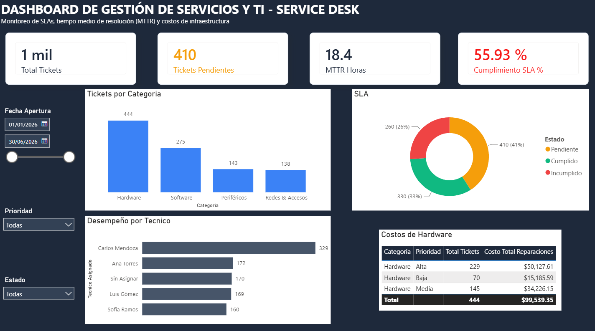

# 🛠️ IT Service Desk ETL & Service Management Analytics

Este proyecto implementa una solución de análisis de datos de punta a punta (End-to-End) para el área de **Gestión de Servicios de TI y Mesa de Ayuda**. Incluye la automatización de un pipeline ETL con **Python** y **MySQL** para procesar reportes de incidencias y un dashboard interactivo en **Power BI** para el monitoreo de SLAs, tiempos de atención ($MTTR$) y costos de infraestructura.

---

## 📸 Vista Previa del Dashboard

---

## 🎯 Caso de Negocio y Objetivos

En las áreas de soporte de TI, el registro manual y heterogéneo de incidencias dificulta la medición en tiempo real del desempeño operativo. Los objetivos principales de este proyecto son:

* **Automatizar la Extracción y Limpieza:** Consolidar reportes con formatos de fecha inconsistentes, valores nulos y categorías no estandarizadas.
* **Monitorear SLAs de Atención:** Evaluar el cumplimiento de tiempos de respuesta según la prioridad del ticket.
* **Optimizar el MTTR (Mean Time to Resolve):** Identificar cuellos de botella por técnico y por categoría de servicio.
* **Control de Costos:** Supervisar el gasto acumulado en reparaciones y reemplazos de hardware.

---

## 🏗️ Arquitectura de la Solución

1. **Simulación de Datos (Python - Faker & Pandas):** Generación de reportes diarios de incidencias con imperfecciones de datos reales.
2. **Pipeline ETL (Python - Pandas & SQLAlchemy):** 
   * Limpieza de cadenas de texto y normalización de categorías.
   * Parseo y estandarización de fechas (`datetime`).
   * Validación de calidad de datos (*Data Quality Checks*) para prevenir inconsistencias en los tiempos de respuesta.
   * Reglas de negocio para evaluación del cumplimiento de $SLA$.
   * Carga directa a **MySQL Database**.
3. **Capa de Modelado y Visualización (Power BI & DAX):**
   * Modelado de datos e implementación de medidas clave ($MTTR$, % Cumplimiento SLA, Backlog Activo, Costos).
   * Interfaz ejecutiva UX/UI optimizada para toma de decisiones.

---

## 📊 Principales Métricas e Indicadores (KPIs)

* **$MTTR$ (Mean Time to Resolve):** Tiempo promedio en horas para la resolución de tickets cerrados.
* **Cumplimiento de SLA (%):** Porcentaje de tickets resueltos dentro del marco de tiempo establecido (Alta $\le$ 12h, Media $\le$ 24h, Baja $\le$ 48h).
* **Backlog Activo:** Volumen de incidencias actualmente abiertas o en proceso.
* **Costo Total de Reparaciones (USD):** Presupuesto ejecutado en hardware y repuestos.

---

## 🚀 Cómo Ejecutar este Proyecto

### Requisitos Previos
* Python 3.9+ con las librerías `pandas`, `numpy`, `faker`, `sqlalchemy` y `pymysql`.
* Servidor **MySQL** local o remoto (MySQL Workbench).
* **Power BI Desktop**.

### Pasos de Instalación
1. **Clonar el repositorio:**
   
git clone [https://github.com/TU_USUARIO/it-servicedesk-etl-analytics.git](https://github.com/TU_USUARIO/it-servicedesk-etl-analytics.git)
cd it-servicedesk-etl-analytics

3. **Instalar dependencias necesarias:**
 
pip install pandas numpy faker sqlalchemy pymysql

4. **Crea la base de datos en MySQL:**
   
CREATE DATABASE IF NOT EXISTS ti_service_desk;

5. **Configurar credenciales y ejecutar la canalización (Pipeline ETL):**

Edita la variable DB_PASS en scripts/etl_pipeline.py con tu contraseña de MySQL local.

Ejecuta los scripts desde tu terminal:
python scripts/generar_datos_ti.py
python scripts/etl_pipeline.py

6. **Visualizar el Dashboard:**

* Abre dashboards/service_desk_dashboard.pbix en Power BI Desktop.
  
* Haz clic en Actualizar (Refresh) para cargar los datos importados directamente desde MySQL.
